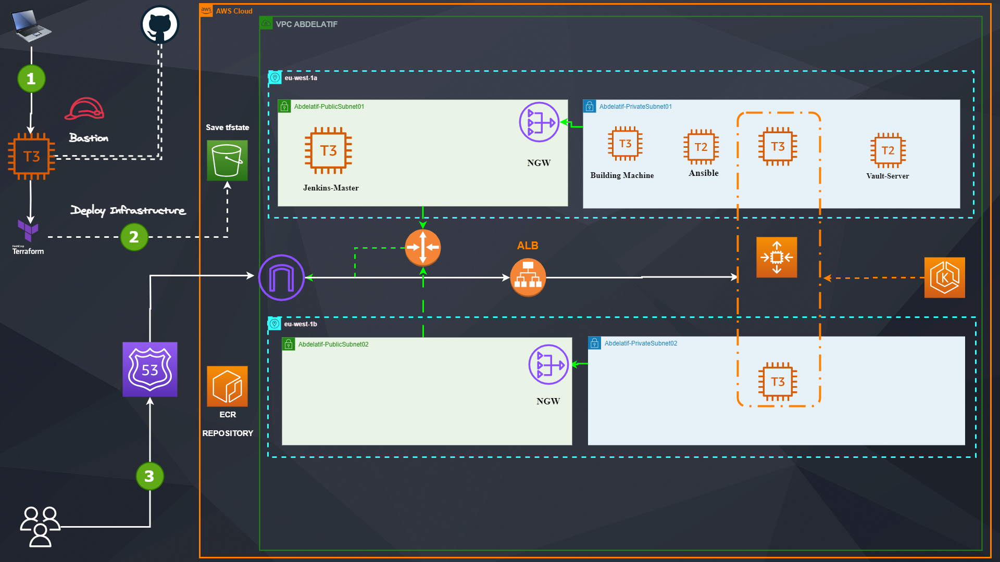
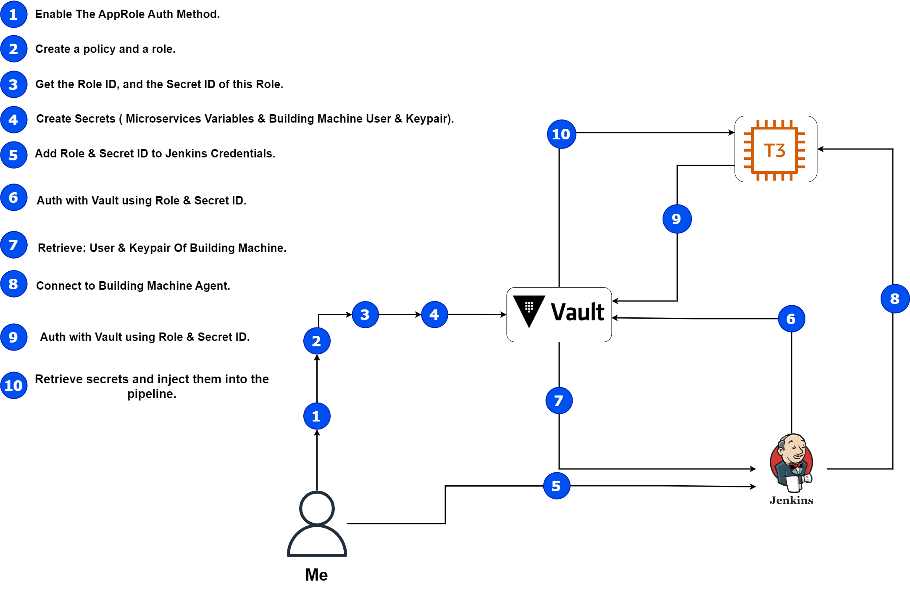
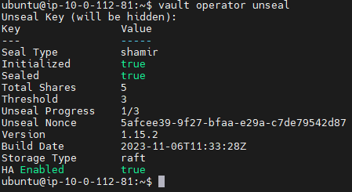
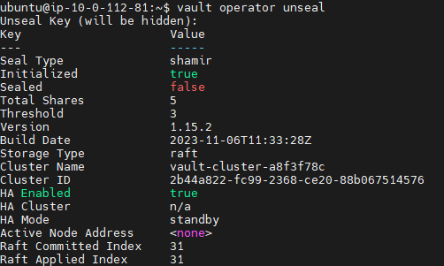
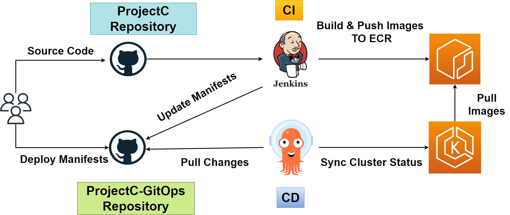
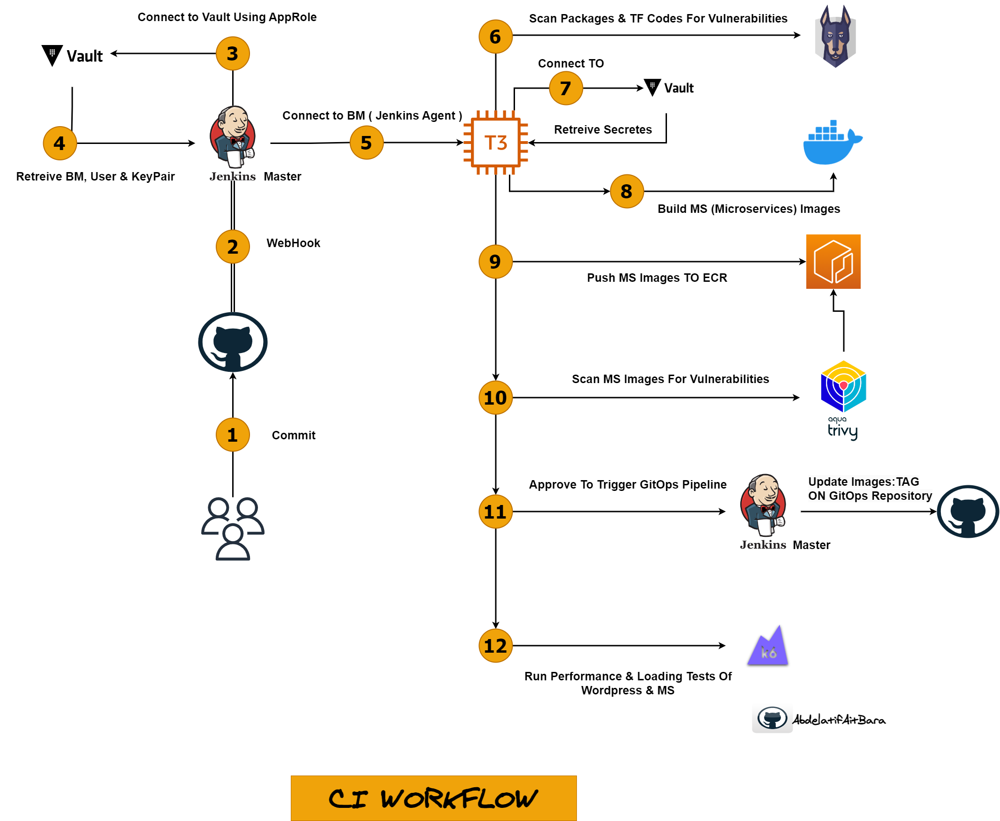
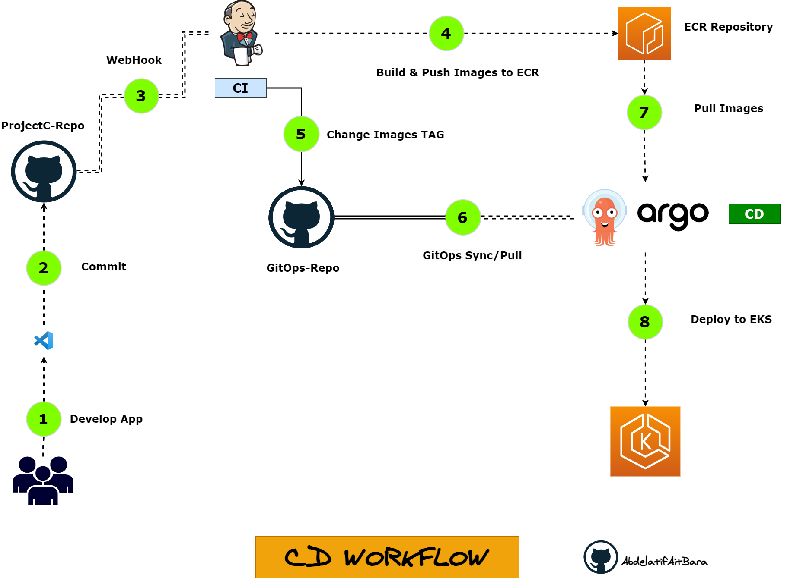

 [](https://wordpress.org/)
[](https://woocommerce.com/)
[](https://en.wikipedia.org/wiki/Representational_state_transfer)
[](https://jenkins.io/)
[](https://www.docker.com/)
[](https://aws.amazon.com/)
[](https://kubernetes.io/)
[](https://nginx.org/en/)
[](https://www.terraform.io/)
[](https://snyk.io/)
[](https://aquasecurity.com/products/trivy)
[](https://www.python.org/) 


### Project Infrastructure :



# How To Deploy This Solution:


### **<span style="font-weight:bold; color:#00b050">01- Clone The Repository On Your Bastion Machine :</span>**

### **<span style="font-weight:bold; color:#00b050">02- Run Terraform Apply Inside ProjectC/Infra</span>**

### **<span style="font-weight:bold; color:#00b050">03- Deploy Apps Using ArgoCD In The Bellow Order :</span>**

- Wordpress Blue/Green
- Nginx Ingress Controller
- Microservices Blue/Green

- To get ArgoCD Secret:
  
```
kubectl -n argocd get secret argocd-initial-admin-secret -o jsonpath="{.data.password}" | base64 -d
```

- To expose argocd-server service, ane get access to it using your EC2 Bastion PublicIP.
  
```
kubectl port-forward svc/argocd-server -n argocd 4001:443 --address 0.0.0.0
```

### ArgoCD Workflow:


GitOps Repository Link: https://github.com/AbdelatifAitBara/ProjectC-GitOps


### **<span style="font-weight:bold; color:#00b050">04- Vault Server Configuration :</span>**

### Vault Architecture:




- Connect to your Vault Server via SSH.

- Run:

```
sudo nano /etc/vault.d/vault.hcl
```

Past the configuration bellow on it:


```

storage "raft" {
  path    = "/opt/vault/data"
  node_id = "raft_node_1"
}

listener "tcp" {
  address     = "0.0.0.0:8200"
  tls_disable = 1
}

api_addr = "http://127.0.0.1:8200"
cluster_addr = "https://127.0.0.1:8201"
ui = true


```


- Run the followings commands in order: 

```

sudo systemctl start vault

sudo systemctl stop vault

sudo systemctl start vault

```


- Now we should add the ip addr of our Vault Server to our env:
- Open ".profile" by running : "sudo nano ~/.profile" and add the bellow line in it:


```
export VAULT_ADDR='http://127.0.0.1:8200'
```

- Now run : "source ~/.profile" to load your env.
- If you would to check that you did everything correctly run: "env | grep VAULT_ADDR".
- Now you can initilize your Vault Server by running, you should get 5 KEYs and login_token (SAVE THEM IN A SAFE PLACE) :

```

vault operator init

```


- Now we have to UNSEAL our Vault Server by running this command 3 TIMES, and enter the secrets that we got early "WE NEED JUST 3 SECRETS":

```

vault operator unseal

```


- After checking that the SEAL is FALSE.

### Vault Sealed Mode=TRUE:


  

### Vault Sealed Mode=FALSE:



- We Can Login Now:

```

vault login login_token

```

- Now we'll enable the AppRole Auth Mehod:

```

vault auth enable approle

```

- After it we have to create the role for Jenkins and make it usage illimit :


```

vault write auth/approle/role/jenkins-role token_num_uses=0 secret_id_num_uses=0 policies="jenkins"

```

- To get the RoleID and the RoleSecret_ID, We'll add the values later to our Jenkins Credentials :

```

vault read auth/approle/role/jenkins-role/role-id

vault write -f auth/approle/role/jenkins-role/secret-id

```

- Now we can enable The Secrets of type "KeyValues" :

 
```
vault secrets enable -path=secrets kv

```

- Finally, we'll create a Policy for our AppRole, to be able to wread all the secrets on this path "secrets/creds/":


```
nano jenkins-policy.hcl

```

```
path "secrets/creds/*" {
 capabilities = ["read"]
}

```


- If you did everything correctly, you'll be able to write your KV now:

1- First KV, is the credentials of our BuildingMachine (Jenkins Agent).

```

vault write secrets/creds/ec2_abdelatif username=ubuntu private_key="$(cat /home/ubuntu/key.pem)" passphrase=
```


2- The Second KV, will be the microservices Secrets:

```
vault write secrets/creds/microservices MYSQL_DATABASE_USER=<value> MYSQL_DATABASE_PASSWORD="<value>" MYSQL_DATABASE_DB=<value> dbport="<value>" productapiurl="https://projetc.abdelatif-aitbara.link/wp-json/wc/v3/products" orderapiurl="https://projetc.abdelatif-aitbara.link/wp-json/wc/v3/orders" customerapiurl="https://projetc.abdelatif-aitbara.link/wp-json/wc/v3/customers" MYSQL_DATABASE_HOST=<value> secretkey="<value>" consumerkey=<value> consumersecret=<value> ecr-username="AWS" ecr-repository="<value>" k6token="<value>"

```


### **<span style="font-weight:bold; color:#00b050">05- Jenkins Configuration :</span>**


### CI/CD Overview:



### CI Workflow:



0- Install plugins : 


```
Vault
Snyk
Blueocean
```


2- **<span style="font-weight:bold; color:#ff0000">Add JavaPath to JDK TOOLS</span>**:   /usr/bin/java

2- Configure VAULT SERVER, Add Vault Credentials, VAULT APP ROLE.

3- Add Agents Credentials ( user, pairkey, passphrase )

4- Configure Agents ( You have to add the keypair in your Vault before )

5- Add SSH-Public Key OF JENKINS CONTAINER to GitHub And Add IT TO BM :

```
ssh-keygen -t ed25519 -C "your_email"

ssh-keyscan github.com >> ~/.ssh/known_hosts


```

6- Configure Snyk Installation ( TOOLS ) and  add a new TOKEN (Credentials), 

7- Change the IP OF OUR VAULT ON Jenkinsfile

8- Add EC2 Jenkins Public Dns To Your GitHub Webhook.

9- Create "Microservices" and "GitOps" Pipelines.

### ArgoCD WorkFlow:




### **<span style="font-weight:bold; color:#00b050">07- Add Let's Encrypt Certificate To ACM :</span>**


```

1- Export Normal tls.crt and tls.key ( this issuer key)
2- Make a combination between them on : tls-combinated.crt 

- At the beginning put the key part (goted from issuer ) and after the cert part
- after it convert it to .pem

3- openssl x509 -in tls.crt -out cert.pem

```


[]
